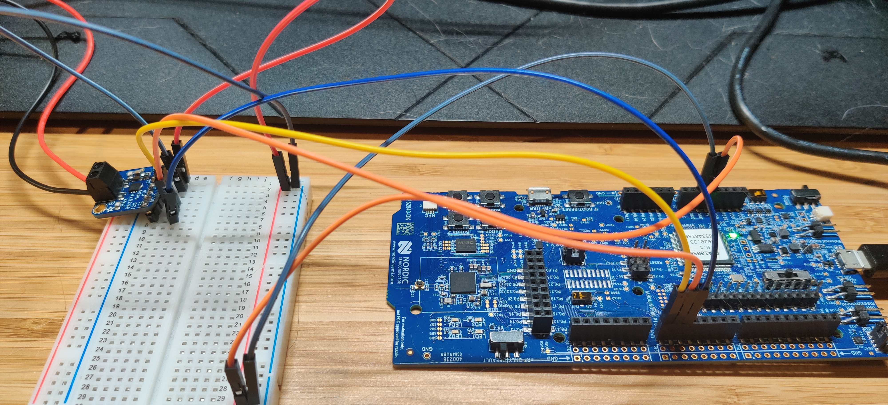

# test I2S

I wanted to start developing with nrf52840DK and rust and set myself to do a simple build that would play a sound when I press a button.
I purchased a MAX98357A and a speaker to make that happen.

I tested the MAX98357A and speaker separately with a rpi, everything works fine through i2s (using all prewritten adafruit code).

I then proceeded to switch the rpi to the nrf52840DK board, using this repo (i2s binary).

BUT no sound is played throught the speaker!

I don't think the code per se is the issue, as it is very very close to the example provided by the nrf-hal.

Here is the wiring:

Any ideas welcome!
